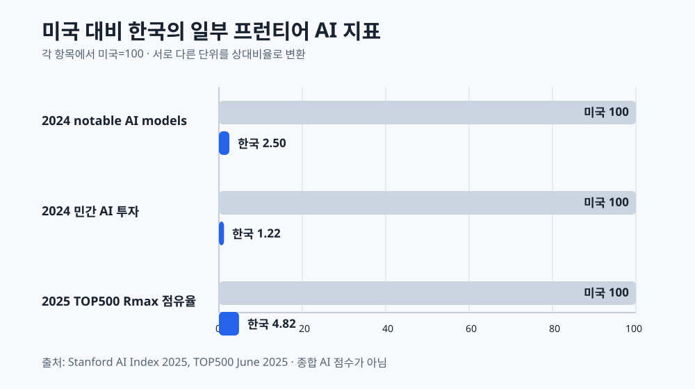
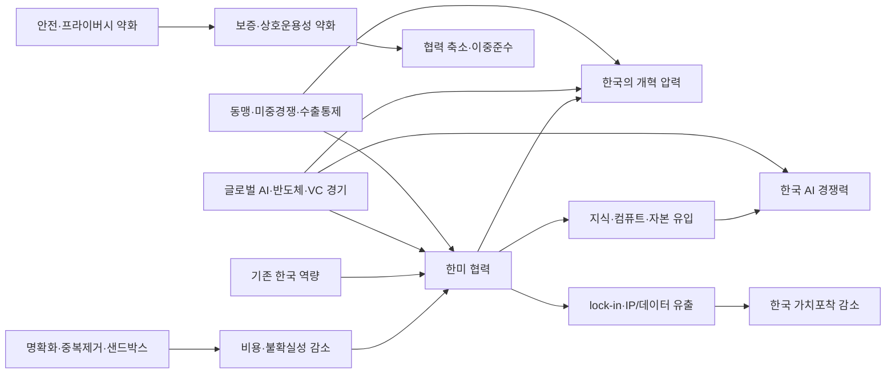

# 한국 AI 규제 완화는 한미 디지털 협력과 AI 경쟁력을 강화하는가

## 학습용 연구보고서

조사 기준일: **2026-09-01**

---

## 0. 먼저 결론

### 판정

**논제의 원문 그대로라면 반대에 가깝다.**
한국이 AI 규제를 “완화하면” 한미 디지털 협력이 강화되고, 그 결과 한국 AI 경쟁력이 높아진다는 넓은 인과연쇄는 입증되지 않았다.

그러나 **조건부·표적 완화**는 지지할 수 있다.

- 저위험 AI의 중복 서류와 불명확한 분류를 간소화한다.
- 이미 동등한 보호를 제공하는 분야법·해외평가·표준 인증을 재사용한다.
- 불필요한 데이터 호스팅 장벽을 계약·암호화·감사·사고통지로 대체한다.
- 프라이버시, 보안, 평가증거, 인적 재검토와 사고대응은 유지한다.
- 특례는 기간제·감사가능·철회가능하게 만든다.

### 가장 방어 가능한 문장

> **표적화되고 상호운용 가능한 디지털무역 개혁은 일부 한미 AI 거래를 촉진할 수 있다. 그러나 한국 AI 경쟁력에 대한 순효과는 입증되지 않았으며, 그 효과는 보호장치·경쟁정책·국내 흡수역량에 달려 있다.**

---

## 1. 논제를 풀기 위한 용어 구별

### 1.1 “AI 규제”는 하나가 아니다

| 규제 묶음 | 예시 | 완화 시 기대효과 | 완화 시 위험 |
|---|---|---|---|
| 안전·투명성 | 고영향 분류, 표시, 위험관리, 문서화 | 출시비용·불확실성 감소 | 사고·해외조달 증거 부족 |
| 개인정보·데이터 | 동의, 이전, 목적 외 이용, 보안 | 데이터 이용·국경간 운영 확대 | 적정성·신뢰·권리 침해 |
| 저작권·콘텐츠 | 학습데이터, 딥페이크, 출처표시 | 학습·콘텐츠 생성 촉진 | 창작자 피해·소송 증가 |
| 분야별 규제 | 의료, 금융, 채용, 공공조달 | 승인·배치 가속 | 차별·안전·설명의무 약화 |
| 경쟁·플랫폼 | 네트워크, 플랫폼, 클라우드 | 미국 기업 진입·서비스 연동 | 국내 시장집중·종속 |
| 안보·수출통제 | 첨단칩, 투자심사, 연구보안 | 일부 거래 촉진 가능 | 동맹 협력상 오히려 강화 필요 |

논제에서 “규제 완화”를 정의하지 않으면 서로 반대 방향의 정책을 하나의 처치변수로 묶게 된다.

### 1.2 완화의 일곱 형태

1. **폐지**: 의무 자체를 없앤다.
2. **적용범위 축소**: 특정 위험·기업·용도만 제외한다.
3. **의무 축소**: 빈도·서류·절차를 줄이되 핵심 보호는 유지한다.
4. **유예**: 시행·집행 시점을 늦춘다.
5. **샌드박스**: 감독 아래 기간·범위를 정해 시험한다.
6. **상호인정**: 상대국의 적합성평가 결과를 일정 조건에서 받아들인다.
7. **표준조화**: 평가 기준·문서·시험방법을 공통 기준에 맞춘다.

**상호인정은 평가 결과를 받는 것이고 표준조화는 기준을 맞추는 것이다. 둘 다 규제 폐지와 다르다.**

### 1.3 경쟁력도 하나가 아니다

- 이용자 생산성
- 한국 기업의 매출·시장점유율
- 한국 소유의 IP·데이터·부가가치
- 스타트업 진입·스케일업
- 프런티어 모델·컴퓨트
- 수출·표준 영향력
- 공급망 자율성과 전환비용

미국 AI 서비스 이용이 늘어 한국 소비자 생산성이 높아져도 한국 AI 기업 점유율은 떨어질 수 있다. 무엇을 경쟁력으로 볼지 먼저 정해야 한다.

---

## 2. 첨부 논문 3편에서 무엇을 배울 것인가

### 2.1 신승휴(2025): 미국의 거래적 AI 동맹외교

**서지**
신승휴, 「사이버-AI 넥서스와 미국의 동맹외교: 바이든 행정부와 트럼프 행정부를 중심으로」, 『아태연구』 32(4), 121-154. [DOI](https://doi.org/10.18107/japs.2025.32.4.005)

**핵심 논지**

- 트럼프 2기 미국은 AI 규제보다 혁신·성장과 미국산 AI 수출을 우선한다.
- 동맹 협력도 보편규범보다 국익·거래 중심으로 이동한다.
- 규제 약화는 데이터 품질, 탈옥 방어, AI 안전·책임의 동맹 정합성을 낮출 수 있다.
- 미국 기술 수용이 한국의 데이터 주권과 가치포착에 손해가 될 가능성도 있다.

**보고서에서 쓰는 방법**

- 찬성: 미국 정책 방향과 상업·수출 협력의 호환성 논거.
- 반대: 규제 완화가 안전협력과 데이터 주권을 해칠 수 있다는 반론.
- 조건부: 상용화 마찰은 줄이되 사이버보안·데이터 품질·선거안전은 유지.

**한계**

정성적 정책·문헌 분석이다. 규제 완화가 투자·생산성·한미 협력 성과를 높였다는 인과추정은 없다.

### 2.2 이주형(2025): 연성법과 디지털경제협정

**서지**
이주형, 「인공지능(AI) 관련 규범과 연성법의 역할에 관한 소고: 디지털경제협정을 중심으로」, 『사법』 1(72), 3-38. [DOI](https://doi.org/10.22825/juris.2025.1.72.001)

**핵심 논지**

- 빠르게 바뀌는 AI는 경성법만으로 국제규범을 적시에 만들기 어렵다.
- OECD·UN 등의 연성규범이 디지털경제협정에 들어가고 점차 제도화된다.
- 지속가능한 경로는 탈규제가 아니라 경성법·연성법 혼합, 신뢰, 규제 정합성, 상호운용성이다.
- 한국 협정의 AI 조항은 강한 의무보다 협력 중심의 중간 수준이다.

**보고서에서 쓰는 방법**

- 찬성: 과도·중복 규정의 단순화와 유연한 연성법 활용.
- 반대: 안전·책임의 국제원칙이 협력 기반이므로 광범위 철폐는 부적절.
- 조건부: 고위험은 구속규범, 저위험은 가이드·표준·샌드박스.

**한계**

시행 전 법·협정 비교연구다. 실제 기업비용이나 한미 공동사업 성과를 측정하지 않는다.

### 2.3 김진규(2026): 위험기반 규제와 디지털무역장벽

**서지**
김진규, 「위험 기반 방식의 인공지능시스템 규제와 디지털 무역장벽: 한국과 EU의 인공지능 법규 비교 분석」, 『통상정보연구』 28(1), 129-152. [KCI 레코드](https://www.kci.go.kr/kciportal/ci/sereArticleSearch/ciSereArtiView.kci?sereArticleSearchBean.artiId=ART003326175)

**핵심 논지**

- 한국 고영향 AI 정의의 불확실성과 EU와의 절차 차이는 이중 준수비용을 만들 수 있다.
- 동일 사업자가 중복된 안전성·영향평가 의무를 질 가능성이 있다.
- 한국법은 EU보다 제재가 약하고 선허용·후규제 성격이 강해 무역제한성이 낮다.
- 해법은 전면 철폐가 아니라 정의 명확화, 국제표준, 적합성평가 상호인정, 상호운용성이다.

**보고서에서 쓰는 방법**

- 찬성: 모호성·중복·시장진입 비용을 줄여야 한다.
- 반대: 한국법은 이미 EU보다 경량이므로 추가 광범위 완화는 불필요하다.
- 조건부: ISO/IEC 기반 위험관리와 이용자 보호를 유지하면서 중복심사만 제거한다.

**한계**

비교법·문헌고찰이며 기업별 비용·수출·투자 자료가 없다. 일부 시행령 시점 설명은 현행 공식 법령과 맞지 않아 법적 현황은 법령정보센터 자료를 우선해야 한다.

### 2.4 세 논문의 공통 결론

세 편 모두 “규제가 적을수록 경쟁력이 높다”를 실증하지 않는다. 공통분모는 다음이다.

- 정의와 적용범위를 명확히 할 것
- 중복 절차를 줄일 것
- 국제표준과 상호인정을 활용할 것
- 상호운용성과 신뢰·안전을 함께 설계할 것

---

## 3. 한국 현행 AI 규제

### 3.1 법적 상태

- AI 기본법 최초 법률 제20676호: 2025-01-21 공포
- 현행 통합 법률 제21311호: 2026-01-20 공포
- 법과 시행령의 주요 의무 시행: **2026-01-22**
- 현행 통합 시행령: 대통령령 제36580호, 2026-08-20 시행

공식 원문: [AI 기본법](https://www.law.go.kr/법령/인공지능발전과신뢰기반조성등에관한기본법), [현행 시행령 XML](https://www.law.go.kr/DRF/lawService.do?OC=test&target=law&MST=288781&type=XML)

### 3.2 주요 사업자 의무

#### 투명성

- 고영향 또는 생성형 AI 제품·서비스라는 사실을 사전에 알린다.
- 생성물에는 사람이 인지하거나 기계가 읽을 수 있는 표시를 한다.
- 기계판독 표시만 하면 텍스트·음성 등 추가 안내도 필요하다.
- AI 사용이 명백하거나 내부업무 전용인 경우 등의 예외가 있다.

[현행 시행령 제23조](https://www.law.go.kr/joStmdInfoP.do?lsiSeq=288781&joNo=0023&joBrNo=00)

#### 고영향 AI

- 사업자가 먼저 고영향 여부를 검토한다.
- 해당하면 위험관리, 설명, 이용자 보호, 인적 감독, 문서 작성·보관을 수행한다.
- 다른 법률의 동등한 조치가 있으면 중복을 줄일 수 있다.

#### 안전성 의무

다음 세 조건을 **모두** 충족해야 시행령 제24조의 대규모 안전성 의무 대상이다.

1. 학습 누적 연산량 10^26 FLOP 이상
2. 최첨단 AI 기술 적용
3. 생명·신체·기본권에 광범위하고 중대한 위험 가능성

컴퓨트 기준 하나만으로 모든 대형모델을 규제한다고 쓰면 틀리다.

### 3.3 계도기간의 의미

과기정통부는 최소 1년의 계도기간 동안 일부 사실조사와 과태료 집행을 유예한다고 밝혔다. 그러나 법적 의무는 2026-01-22 이미 시행됐다.

- **법적 의무**: 시행 중
- **가이드라인**: 비구속적 해석·예시
- **계도기간**: 집행정책

### 3.4 과도한 규제인가

가장 정확한 평가는 다음이다.

> **법적 구조는 EU보다 경량·촉진 중심이지만 적용경계가 불명확하다. 고정적인 법무·문서화·인적 감독 업무가 작은 기업에 상대적으로 무거울 가능성은 있으나, 한국 기업의 사후 준수비용이나 혁신손실은 아직 측정되지 않았다.**

과도성 주장에 불리한 사실:

- 민간 영향평가는 일반적인 강제 사전승인보다 약한 노력의무다.
- 과태료가 모든 고영향 의무에 바로 붙는 구조가 아니다.
- 동등조치, 표시 예외, 책임 분배와 계도기간이 있다.
- AI 기본법은 R&D, 컴퓨트, 데이터, 창업지원 근거도 둔다.

반대로 과소규제 주장도 존재한다.

- 고영향 범위가 좁고 EU식 금지 AI 범주가 약하다.
- 딥페이크·차별·기본권 피해에는 사전보호가 필요하다.
- 약한 집행이 피해 발생 전 억제력을 충분히 제공하는지는 불명확하다.

---

## 4. 미국 현행 AI 규제

### 4.1 한 문장 요약

**미국은 수평적 민간 AI 연방법 없이 연방 친혁신·수출·조달·안보 정책과 기존 분야별 법률, 주법이 중첩된 체계다.**

### 4.2 실제 완화된 것

- Biden EO 14110 폐기
- 연방 차원의 경쟁력·인프라·수출 우선
- AI Diffusion Rule 철회
- 일부 연방 가이드·제안 철회 또는 축소

공식 자료: [EO 14179](https://www.federalregister.gov/executive-order/14179), [America's AI Action Plan](https://www.whitehouse.gov/wp-content/uploads/2025/07/Americas-AI-Action-Plan.pdf)

### 4.3 여전히 존재하거나 확대된 것

- FTC Act, 신용·고용·주거·의료·증권·저작권 등 분야별 법률
- TAKE IT DOWN Act의 AI 성적 딥페이크 삭제 의무
- 연방 AI 조달의 상호운용성, 독립평가, 모니터링, 데이터/IP 보호
- 첨단칩·최종사용자·우회수출 통제
- 텍사스·캘리포니아·콜로라도 등 주별 AI 의무
- NIST AI RMF와 GenAI Profile

NIST는 자발적이지만 계약·조달·safe harbor에 들어가면 실제 요구사항이 된다.

### 4.4 날짜 주의

- Colorado SB24-205는 그대로 시행된 것이 아니다.
- 2026년 SB26-189로 폐지·재제정됐고 주요 ADMT 의무는 2027-01-01 시작한다.
- FTC의 2026년 AI 정확성 정책성명은 조사 기준일 현재 **제안** 단계다.
- EO 14365는 주법을 자동 선점하지 않는다.

### 4.5 한국에 주는 함의

한국 국내 의무를 줄여도 미국 시장에서 요구되는 주법·조달·분야별 증거는 남는다. 국내 문서·평가체계를 없애면 미국용 별도 체계를 다시 만들어야 해 비용이 이동할 수 있다.

---

## 5. 한국 AI 산업 경쟁력

### 5.1 강점

- HBM·메모리와 AI 공급망
- 공공데이터와 디지털정부
- 높은 특허 활동
- 빠른 소비자 AI 채택
- 국내 언어모델과 한국어 성능
- 의미 있는 HPC 기반

### 5.2 격차

| 지표 | 한국 | 미국 | 주의 |
|---|---:|---:|---|
| 2024 notable AI models | 1 | 40 | 큐레이션된 공개 모델 |
| 2024 민간 AI 투자 | $1.33bn | $109.08bn | 비공개 사내 R&D 누락 가능 |
| 2025-06 TOP500 시스템 | 15 | 175 | AI GPU가 아닌 HPC 대행 지표 |
| 2025-06 TOP500 Rmax 점유율 | 2.335% | 48.41% | 비공개 클러스터 누락 가능 |

### 5.3 병목의 증거순위

1. **자본·시장규모**: 민간투자와 스케일업 금융의 큰 격차
2. **프런티어 컴퓨트 스택**: accelerator, CUDA, 하이퍼스케일 클라우드, 클러스터 엔지니어링
3. **고급인재와 이동성**: senior researcher, 보상, 국제유입
4. **상용화·글로벌 유통**: 모델 API·소프트웨어·기업채널
5. **SME와 일반직군 확산**
6. **고가치 민간·분야데이터**
7. **규제 마찰**: 데이터 재사용, 클라우드 조달, 고영향 분류, 작은 기업의 고정비

### 5.4 규제 귀속의 시간 문제

한국 AI 기본법은 2026년 1월 시행됐다. 위 격차 대부분은 2023~2025년 자료다. 따라서 기본법이 현재 격차를 만들었다는 주장은 시간적으로 성립하지 않는다.

가능한 기존 규제 채널은 별도로 보아야 한다.

- PIPA와 분야별 데이터 이용 불확실성
- 학습데이터 저작권
- CSAP·망분리·클라우드 조달
- 의료·금융 등 부처별 승인

---

## 6. AI 규제의 경제효과

### 6.1 비용 경로

- 법무·분류·문서화·모니터링 고정비
- 출시 지연과 불확실성
- 중복된 관할권 평가
- 작은 기업에 더 큰 평균비용
- 데이터 접근·클라우드 통합 제한

### 6.2 편익 경로

- 사고·차별·보안피해 감소
- 조달·보험·계약의 신뢰 증거
- 데이터 이전 적정성과 인증
- 표준화된 문서 재사용
- 사후 소송·리콜·급격한 재규제 위험 감소

### 6.3 비용은 없어지지 않고 이동할 수 있다

국내 규제가 줄어도 다음 비용이 생길 수 있다.

- 미국 조달용 독립 평가
- 캘리포니아·텍사스·콜로라도별 준수
- EU 시장용 별도 증거
- 계약별 감사·보증·보험·면책
- 사고 후 시장중단과 재규제

따라서 봐야 할 것은 “규제비용” 하나가 아니라 **총거래비용과 순가치포착**이다.

### 6.4 실증상 한계

GDPR 유사연구에서는 벤처투자와 앱 진입 감소가 보고되지만 개인정보 편익과 식별상 한계도 확인된다. 이 연구들은 한국 AI 기본법이나 한미 협력을 직접 추정하지 않는다.

신뢰효과도 단조롭지 않다. 설명가능성은 평균적으로 신뢰와 중간 정도 관련되지만 AI 사용 공개가 신뢰를 낮춘 실험도 있다.

---

## 7. 한미 디지털·AI 협력

### 7.1 층위 구조

| 층위 | 수단 | 정렬 수준 |
|---|---|---|
| 구속규범 | KORUS 디지털상품·전자서명·소비자보호·투명성·금융데이터·통신 | 법적 의무 |
| 표적 정치약속 | 2025 공동 팩트시트의 플랫폼·네트워크·데이터이전 | 정책변경 예정, 후속문서 미확인 |
| 비구속 협력 | TPD, CET Dialogue, ICT Forum, SCCD | 유연한 정책 수렴 |
| 기술·과학 협력 | R&D, 표준, AI 안전시험, 인재, 위협공유 | 국내 AI 규제 완화 불필요 |

### 7.2 2025 TPD

[U.S.-ROK Technology Prosperity Deal](https://www.whitehouse.gov/releases/2025/10/u-s-korea-technology-prosperity-deal/)은 다음을 묶는다.

- 친혁신 AI 정책
- AI 수출과 AI-ready datasets
- 기술보호와 compute protection
- 산업표준·계측·AI 안전연구소 협력
- 상호운용성
- 운영부담과 불필요한 데이터 호스팅 장벽 축소
- trusted, privacy-preserving, secure innovation

MOU 자체는 법적 의무를 만들지 않는다고 명시한다.

### 7.3 2025 공동 팩트시트

[공동 팩트시트](https://www.whitehouse.gov/fact-sheets/2025/11/joint-fact-sheet-on-president-donald-j-trumps-meeting-with-president-lee-jae-myung/)는 다음의 구체성이 더 높다.

- 미국 기업이 네트워크 이용료·온라인 플랫폼 규칙에서 차별·불필요한 장벽을 받지 않게 한다.
- 위치·재보험·개인정보를 포함한 국경간 데이터 이전을 촉진한다.
- KORUS 공동위원회 행동계획을 채택할 예정이라고 밝혔다.

그러나 확인 가능한 후속 행동계획 원문을 찾지 못했다. 발표를 이미 시행된 법적 개혁으로 쓰면 안 된다.

### 7.4 규제 완화 이전 협력

- 2022: AI·양자·바이오 전략기술 대화, 공동 R&D, 표준, 프라이버시·데이터흐름
- 2023: CET Dialogue, NSF 공동연구, 의료 AI 안전, 사이버협력
- 2024: Seoul AI Summit, 국제 AI 안전연구소 네트워크

이 사전협력은 규제 완화가 필요조건이라는 주장을 반박한다.

### 7.5 정렬이 필요한 것과 아닌 것

**정렬이 필요한 분야**

- 개인정보 국경간 이전
- 플랫폼·네트워크 시장접근
- 수출통제·투자심사
- AI compute 보호
- 적합성평가·표준 상호인정

**규제 완화 없이 가능한 분야**

- 공동 R&D와 보조금
- 인재교류
- AI 안전과학·테스트
- 사이버 위협정보 공유
- 공급망 조기경보
- 공동 표준개발

---

## 8. 인과관계 검증

### 8.1 왜 단순 인과가 안 되는가

관측되는 협력 증가는 다음 설명과 모두 맞을 수 있다.

- 규제 완화가 협력을 늘렸다.
- 이미 강한 협력이 규제개혁을 요구했다.
- 동맹정치·미중경쟁·반도체 투자가 둘 다 늘렸다.
- 미국 기업의 시장접근 확대를 협력이라고 불렀다.

### 8.2 필요조건과 충분조건

- **필요조건 아님**: 규제 완화 전부터 협력이 존재했다.
- **충분조건 아님**: 국내 규제를 줄여도 자본·컴퓨트·인재·유통 문제가 남는다.
- **부호 불명**: 어떤 규제를 어떻게 줄이느냐에 따라 효과가 반대다.

### 8.3 실제로 입증하려면

1. 발표가 아니라 실제 이행 규정을 확정한다.
2. 조치별로 AI, 플랫폼, 데이터, 프라이버시, 경쟁규칙을 코딩한다.
3. 시행 전 추세와 유사국가·유사산업을 비교한다.
4. 공동특허·공동보조금·표준시험·JV·상호인정 결과를 측정한다.
5. 미국 매출이 아니라 한국 소유 부가가치·IP·시장점유율·인재 순이동을 본다.
6. 컴퓨트, 환율, 보조금, 반도체 경기, 수출통제를 통제한다.

---

## 9. 세 입장의 최강 논증

### 9.1 찬성: 표적 완화가 필요하다

**주장**

- 모호한 고영향 분류와 중복평가는 실제 법무·문서비용을 만든다.
- 미국은 친혁신 정책과 AI full-stack 수출을 추진한다.
- 2025 양자문서는 운영부담·데이터 호스팅·플랫폼 장벽 축소를 요구한다.
- 국제표준과 상호인정은 다중 관할 준수비용을 줄일 수 있다.

**상대 반박**

- 비용 규모가 측정되지 않았다.
- 미국도 주법·조달·안보규칙이 있다.
- 안전·프라이버시 약화는 오히려 상호운용성을 해친다.

**재반박**

- 찬성은 전면 폐지가 아니라 중복·모호성·불필요한 현지화만 겨냥한다.
- 동등한 보호와 한국 집행권을 유지한 상호인정이라면 신뢰를 훼손하지 않는다.

### 9.2 반대: 현행 보호를 유지해야 한다

**주장**

- 현행 한국법은 이미 EU보다 경량이고 계도·예외·중복완화 장치가 있다.
- 한미 협력은 규제 완화 전부터 안전·표준·프라이버시 중심으로 존재했다.
- 한국 격차의 주된 원인은 자본·컴퓨트·인재·유통이다.
- 약한 국내 증거체계는 미국 조달·EU 시장에서 이중 준수비용을 만들 수 있다.
- 미국 hyperscaler 진입이 한국 가치포착을 높인다는 보장이 없다.

**상대 반박**

- 불명확한 분류와 고정비를 작은 기업이 감당하기 어렵다.
- 데이터 장벽과 중복절차는 양자문서에도 명시된 문제다.

**재반박**

- 행정 간소화와 가이드는 가능하지만 핵심 보호의 삭제까지 정당화하지 않는다.
- 먼저 비용·사고·도입효과를 측정한 뒤 조정해야 한다.

### 9.3 조건부 완화: 가장 강한 입장

두 입장의 강점을 결합한다.

> 보호목표를 없애지 않고, 동일한 보호를 더 낮은 비용으로 달성하는 절차와 증거체계로 바꾼다.

---

## 10. 정책대안: Trusted Interoperability Compact

### 10.1 네 개의 관문

| 관문 | 질문 | 실패하면 |
|---|---|---|
| 위험 | 저위험·제한된 용도인가? | 일반 규칙 적용 |
| 동등성 | 프라이버시·보안·책임 결과가 동등한가? | 상호인정 불가 |
| 운용성 | 문서가 상호운용되고 감사·사고통지가 가능한가? | 특례 불가 |
| 가역성 | 기간·모니터링·철회 조건이 있는가? | 특례 불가 |

### 10.2 구체 조치

1. **고영향 AI 판정의 명확화**
   - 분야, 중대성, 발생가능성, 사업자 역할별 예시 공개
   - 사전 질의와 기한 내 신속한 확인

2. **하나의 재사용 가능한 증빙 패키지**
   - NIST AI RMF, ISO/IEC 42001·23894, 한국 의무를 매핑
   - 다른 분야법의 동등조치와 해외 평가를 재사용

3. **저위험 간소화**
   - 단순 공지·기본 기록으로 충분한 신속절차 경로
   - 고영향·공공·생체·채용·신용에는 자동 면제 없음

4. **조건부 데이터 이전**
   - 일괄적인 현지화보다 암호화, 접근통제, 감사, 계약, 사고통지
   - 개인정보보호위원회의 집행권과 정보주체 권리 유지

5. **상호인정 시범사업**
   - 범주별·기간제
   - 한국 감사·철회권 유지
   - 공개된 동등성 기준과 처리기한

6. **감독형 샌드박스**
   - 사전 성공·중단 기준
   - 사고·민원·배제·비용 데이터 수집
   - 성과가 없으면 자동 종료

### 10.3 성과지표

**혁신**

- 출시기간
- 중복서류 감소
- 스타트업 참여·생존·스케일업

**협력**

- 증빙 패키지 재사용률
- 상호인정 건수
- 공동 R&D·표준시험·JV

**신뢰·안전**

- 배치당 사고
- 감사 통과율
- 민원·구제 완료율
- 사고 탐지·복구시간

**한국 가치포착**

- 한국 소유 IP·부가가치
- 국내 공급자 점유율
- 로열티·데이터·인재 순이동
- hyperscaler 전환비용

---

## 11. 소논문에서의 권장 논지

### 추천 논제문

> 한국은 대미 디지털 협력과 AI 경쟁력 강화를 위해 AI 규제를 포괄적으로 완화해서는 안 된다. 대신 고영향 기준의 모호성, 중복 적합성평가와 불필요한 데이터 호스팅 장벽을 제거하고, 프라이버시·보안·인적 감독·사고대응을 유지한 상호인정·표준조화 체계를 구축해야 한다.

### 글의 순서

1. 규제 완화의 정의를 분해한다.
2. 한·미 현행 규제를 시행/제안/자발로 구별한다.
3. 한국의 경쟁력 병목과 시간순서를 제시한다.
4. 한미 협력이 규제 완화 전에 존재했음을 보인다.
5. 2025 문서에서 표적 장벽 축소와 보호조화를 함께 읽는다.
6. broad 인과연쇄의 역인과·교란·가치포착 문제를 제시한다.
7. 네 관문 조건부 정책을 제안한다.
8. 측정 가능한 사후평가와 자동 종료를 붙인다.

### 피해야 할 문장

- “미국은 AI 규제가 없다.”
- “한국 AI 기본법 때문에 현재 미국보다 뒤처졌다.”
- “규제가 혁신을 X% 감소시켰다.”
- “한미 TPD가 한국 AI 규제 완화를 법적으로 의무화한다.”
- “규제 완화는 자동으로 데이터 이동을 늘린다.”
- “미국 기업 진입이 한국 경쟁력 상승과 같다.”
- “보호규제는 항상 신뢰를 높인다.”

---

## 12. 공부 체크리스트

### 법

- 한국 AI 기본법 31~36조
- 시행령 23·24·29조
- KORUS 15.5·15.8, 22.2, 24.2
- 미국 EO 14179·14365·14409
- NIST AI RMF의 법적 성격
- Texas·California·Colorado의 시행일 차이

### 경제

- 고정비와 SME 평균비용
- 규제준수비용과 계약·조달 비용의 이동
- 자본·컴퓨트·인재·유통의 보완성
- 생산성과 국내 가치포착의 차이
- 상관과 인과, 발표와 시행, 측정과 계획

### 통상

- 비차별과 규제철폐의 차이
- “불필요한 장벽”이 필요한·비례적인 규제를 남긴다는 점
- 데이터 자유이동과 개인정보보호의 결합
- 상호인정과 표준조화의 차이
- TPD MOU와 KORUS 조약의 법적 층위

---

## 13. 미해결 사항

- 2025년 말 채택 예정이었던 KORUS 공동위원회 행동계획 원문
- 과기정통부 위임고시와 계도기간의 정확한 종료·범위
- 한국 기업별 사후 준수비용과 혁신효과
- 한미 AI 계약의 감사·IP·데이터·portability 조항
- 공동사업의 국내 부가가치·IP·인재 순유입

이 항목이 없으므로 broad 인과효과를 수치로 말할 수 없다.

---

## 14. 방법론

- 사용자 지정 논문 3편 원문 직접 추출·페이지별 분석
- 한국·미국 공식 법령과 정부문서 우선
- 법적 시행, 정책, 제안, 자발적 표준을 구별
- 한국 규제, 미국 규제, 과도성, 경쟁력, 경제효과, 한미 협력, 인과반론, 정책대안의 독립 조사축
- 4회의 인과 공격 라운드와 13개 주장 논쟁
- 발견된 오류 정정:
  - 한국 AI 기본법 공포·현행 법률번호
  - 시행령 안전성 의무의 세 가지 결합요건
  - 계도기간과 시행일 구별
  - Colorado 법의 재제정·시행일
  - FTC 정책성명의 제안 상태

전체 원문 링크는 [`SOURCES.md`](SOURCES.md)에서 확인할 수 있다.
