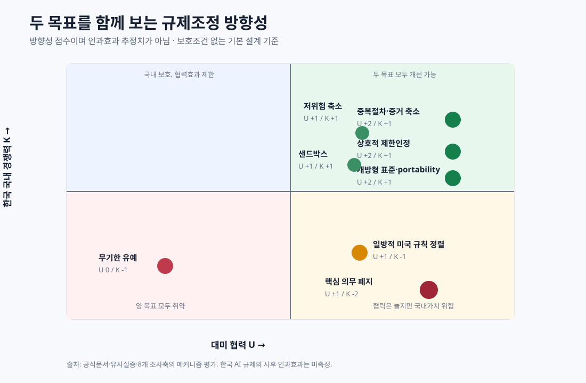

# 정량자료·방향성 점수와 해석 주의사항 — 260902

## 1. 미국과 한국의 AI 격차

| 지표 | 한국 | 미국 | 의미 | 한계 |
|---|---:|---:|---|---|
| 2024 주목할 만한 AI 모델 | 1 | 40 | frontier model 공개·영향력의 제한적 지표 | 비공개·한국어 특화모델 누락 가능 |
| 2024 민간 AI 투자 | $1.33bn | $109.08bn | 민간자본·scale-up 환경 | 사내 R&D·비공개투자 누락 |
| 2025-06 TOP500 aggregate Rmax 점유율 | 2.335% | 48.41% | 공개 HPC compute proxy | 비공개 AI GPU capacity와 다름 |

원자료: [Stanford AI Index](https://aiindex.stanford.edu/report/), [TOP500 June 2025](https://top500.org/lists/top500/2025/06/).

## 2. 양방향 투자

BEA 2025 historical-cost direct-investment position:

| 방향 | Position | Financial transactions |
|---|---:|---:|
| 미국 → 한국 | $37.438bn | $1.410bn |
| 한국 → 미국 | $95.204bn | $3.493bn |

이 수치는 AI 투자, greenfield 시설, 고용, 국내 부가가치가 아니다. 위치는 누적 equity·debt의 historical cost이고 transaction에는 지분·재투자수익·기업간 부채가 포함된다. 직접투자국과 ultimate owner가 다를 수도 있다.

원자료: [BEA U.S. Direct Investment Abroad](https://www.bea.gov/international/di1usdbal), [BEA FDI in the U.S.](https://www.bea.gov/international/di1fdibal).

## 3. 규제조정 방향성 점수

[`data/adjustment-scorecard.csv`](data/adjustment-scorecard.csv)는 각 조치가 별도의 보호조건 없이 설계됐을 때의 방향을 나타낸다.

- `U`: 대미 협력·상호운용성·시장접근
- `K`: 한국 국내 경쟁력·가치포착·전환가능성
- `2`: 강한 플러스 방향
- `1`: 제한적 플러스
- `0`: 불명
- `-1`: 마이너스 위험
- `-2`: 강한 마이너스 위험

점수는 효과추정치가 아니라 공식문서·유사실증·인과메커니즘을 종합한 **정책 선별용 방향성 판단**이다. 한국 AI 기본법 조정의 사후 인과효과는 아직 측정되지 않았다.

## 4. 정책 확대 시 측정할 지표

| 축 | U: 대미 협력 | K: 국내 경쟁력 |
|---|---|---|
| 마찰 | 상호인정 처리기간, 증거 재사용률 | SME 준수시간·외부법무비·출시기간 |
| 시장 | 미국 조달 입찰·낙찰·수출 | 국내 진입·3년 생존·투자·특허·매출 |
| 신뢰 | 공동시험·감사 통과율 | 배치당 사고·민원·구제·탐지율 |
| 경쟁 | 한미 상호 진입비율 | 상위 공급자 집중도·국내 점유율 |
| 가치 | 공동 IP·투자 | 한국 소유 IP·부가가치·세금·로열티 |
| 의존 | trusted access | 외국 cloud/API 지출·전환시간·egress |
| 역량 | 공동 R&D·인재교류 | 국내 R&D·인재 순유입·공급자 역량 |

## 5. 측정값·계획·가설 구별

- **측정값:** BEA position/transaction, Stanford/Top500 지표, 법적 시행일.
- **운영사실:** HBM 생산·개발 발표, 서울 cloud region 개설.
- **계획·정책:** 데이터센터·전력수급 전망, 보도자료 투자계획, G20 의제.
- **정책가설:** portability가 lock-in을 줄인다, 상호인정이 SME 비용을 줄인다.
- **미해결 인과:** 규제조정이 한국기업 가치·고용·혁신·사고에 미치는 순효과.
