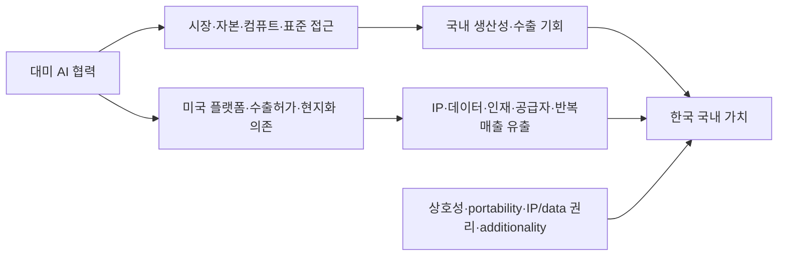

# 우리나라는 대미 디지털 협력 강화 및 AI 산업 경쟁력 강화를 위해 AI 관련 규제를 완화해야 하는가?

## 연구질문

> 우리나라는 대미 디지털 협력 강화 및 AI 산업 경쟁력 강화를 위해 AI 관련 규제를 완화해야 하는가?

조사 기준일: **2026-09-01**

---

## 0. 결론 요약

본고는 대회의 공식 토론 논제에 **조건부 반대**로 답한다. 안전·권리보호 의무를 포괄적으로 낮추는 규제 완화에는 반대하지만, 저위험 영역의 불명확한 기준과 중복 절차를 줄이는 표적적 완화에는 찬성한다.

한국이 조정해야 할 것은 **안전·권리보호의 실질 수준보다 규제의 인터페이스와 이행비용**이다.

대미 AI 협력과 국내 경쟁력은 단기적으로 보완적이다. 미국의 자본·시장·컴퓨트·모델·조달에 접근하면 한국 기업의 도입과 수출이 빨라질 수 있다. 그러나 장기적으로 미국 가속기·클라우드·플랫폼·표준·수출허가가 고객관계·데이터·IP·반복매출을 지배하면 협력은 국내 경쟁력을 약화시킬 수 있다.

따라서 포괄적인 미국식 규제완화나 일방적인 법제 정렬은 부적절하다. 가장 방어 가능한 해법은 다음의 **상호적 규제연결·국내역량 패키지**다.

1. 고영향 AI 기준과 사업자별 책임을 명확히 한다.
2. 저위험 분야의 중복서류와 반복평가는 간소화한다.
3. KORUS 제9장을 활용해 시험방법·증거필드·시험기관 역량을 공통화하되 최종 승인은 각국이 유지한다.
4. AI 학습에는 표준 라이선스·출처기록·권리유보를 우선하고, 입법 시에도 합법적 접근과 개인정보·영업비밀 제외를 갖춘 좁은 안전항만을 검토한다.
5. 클라우드·API 협력에는 데이터·로그·구성·업무의 이식성, 실제 전환시험과 결합판매 제한을 붙인다.
6. 공급망에서는 데이터센터·전력·조달 절차를 신속화하되 수출통제·최종사용자·우회수출·연구보안은 강화한다.
7. 공적지원·세제혜택에는 국내 R&D, 한국 소유 IP, 고급고용, 국내 공급자와 추가성 조건을 붙인다.
8. 한국의 조정은 같은 시점의 미국 시장접근·조달·평가결과 수용과 맞교환하고, 성과가 없으면 자동 종료한다.

이 보고서에서 **규제경쟁력**이란 규제가 적은 상태가 아니라, 같은 보호수준을 더 명확하고 비례적이며 국제적으로 재사용 가능한 방식으로 달성하면서 국내 IP·부가가치·인재·공급자와 정책선택권을 유지하는 역량을 뜻한다.

---

## Ⅰ. 서론: 글로벌 AI 경쟁 심화와 한국의 규제정책 과제

미국은 2025년 이후 연방 차원의 포괄적 사전규제를 낮추는 동시에 AI 인프라, full-stack 수출, 조달, 데이터 보안, 첨단반도체, 전력망과 사이버보안을 산업주도 수단으로 강화했다. [EO 14179](https://www.federalregister.gov/documents/2025/01/31/2025-02172/removing-barriers-to-american-leadership-in-artificial-intelligence)와 [America's AI Action Plan](https://www.whitehouse.gov/wp-content/uploads/2025/07/Americas-AI-Action-Plan.pdf)은 혁신·인프라·국제주도권을 전면에 둔다. 그러나 미국은 무규제 시장이 아니다. 주별 자동결정 규칙, 분야별 소비자·차별·의료 규제, 연방조달, 수출통제와 중요인프라 보안이 병존한다.

한국은 HBM·전자제조·디지털 인프라와 높은 AI 채택이라는 강점을 갖지만 자본, frontier accelerator, hyperscale cloud, 고급인재와 글로벌 유통에서 미국과 큰 격차가 있다. 2024년 주목할 만한 AI 모델은 한국 1개, 미국 40개였고 민간 AI 투자는 각각 13.3억 달러와 1,090.8억 달러였다. 2025년 6월 TOP500 aggregate Rmax 점유율도 한국 2.335%, 미국 48.41%였다. 이 지표는 불완전하지만 규제 하나로 설명하기 어려운 규모·보완자산 격차를 보여준다.

대미 협력은 이 격차를 줄일 수 있지만 미국 기업의 한국 매출, 한국 기업의 대미 투자와 국내 AI 산업 경쟁력은 같은 결과가 아니다. 협력으로 공동잉여가 커져도 미국이 플랫폼·고객·IP·데이터·반복매출을 더 많이 확보하면 한국의 몫은 줄어들 수 있다. 본고는 표준·지식재산권·공급망·투자를 구별하고, 각 축에서 **조정할 인터페이스와 유지할 실질보호 및 국내역량의 경계**를 찾는다.

산업통상부(MOTIR)는 2026년 9월 방미 일정에서 AI 지식재산권·표준·공급망을 G20 혁신협력 의제로 제시했다. 이는 최신 정책배경으로는 유용하지만, 발표 당시 미래 일정이었고 한미 AI 합의·규제완화·투자성과를 입증하지는 않는다. [산업통상부 원문](https://www.motir.go.kr/kor/article/ATCL3f49a5a8c/172144/view)과 Korea.kr 자료는 같은 보도자료의 원문과 전재본이므로 독립 출처로 세지 않는다.

---

## Ⅱ. 본론

### 제1장. 한국 AI 규제체계의 현안과 규제조정의 필요성

#### 1. 위험기반 접근을 중심으로 한 현행 AI 규제

한국 AI 기본법의 핵심 의무는 2026년 1월 22일부터 시행됐다. 법률 제21311호도 기본적으로 같은 날 시행됐으며 취약계층 참여·지원과 영향평가 일부 신설조항만 7월 21일 시행됐다. 현행 시행령은 7월 지원·기관 조항 개정과 8월 타법개정을 반영한 대통령령 제36580호다. [법률 개정이력](https://www.law.go.kr/lsRvsDocListP.do?lsId=014820)과 [시행령 개정이력](https://www.law.go.kr/lsRvsDocListP.do?lsId=015032)을 구별해야 한다.

주요 의무는 다음과 같다.

| 규제대상 | 주요 의무 | 법적 성격 |
|---|---|---|
| 생성형·고영향 AI | 사전고지·생성물 표시 | 구속적 의무 |
| 대규모 첨단 AI | 생명·신체·기본권 위험관리·결과제출 | 시행령 제24조의 세 요건을 모두 충족할 때 |
| 고영향 AI | 사전분류, 위험관리, 설명, 이용자보호, 인적 감독, 문서화 | 구속적 의무 |
| 민간 영향평가 | 기본권 영향평가 | 노력의무 |
| 인증 | 자율 인증과 공공조달 선호 | 일반적 사전허가가 아님 |
| 일정 규모 외국사업자 | 국내대리인 | 시장·이용자 효과와 시행령 기준 |

안전성 의무의 `10^26 FLOP`, 최첨단 기술, 광범위·중대한 위험이라는 세 요건은 법률 제32조가 아니라 **시행령 제24조**에 있고 모두 충족해야 한다.

AI 기본법은 개인정보보호법, 의료·금융·채용·공공행정·클라우드·저작권 규제를 대체하지 않는다. 개인정보 처리에는 PIPA의 적법근거·민감정보·국외이전·자동화결정권이 독립적으로 적용되고, 의료·금융·공공조달에는 각 소관기관의 허가·감독·절차가 남는다.

#### 2. 현행 규제의 불명확성·중복과 잠재적 부담

문제는 규제의 존재보다 다음의 적용경계다.

- 어느 수준의 영향이 고영향인지 사업자가 먼저 판단해야 한다.
- 범용모델 제공자와 분야별 배치자의 책임·증거 접근이 불명확하다.
- PIPA·의료·금융·공공조달 자료가 AI 기본법 문서와 어느 정도 중복되는지 불명확하다.
- 외국 표준·인증은 증거로 제출할 수 있지만 자동으로 한국법 의무를 면제하지 않는다.
- 작은 기업은 같은 법무·분류·문서화 고정비를 더 적은 매출과 인력으로 부담한다.

다만 한국 기업의 사후 준수비용·투자감소·시장퇴출을 추정한 자료는 아직 없다. 기본법 시행 전의 모델·투자·컴퓨트 격차를 이 법의 결과로 돌릴 수도 없다. GDPR·영국 fintech sandbox·ISO 인정협력 연구는 고정비·샌드박스·상호인정의 메커니즘을 보여주는 유사증거일 뿐 한국 AI 규제의 효과가 아니다.

기업규모는 같은 고위험 시스템의 안전의무를 낮추는 기준이 되어서는 안 된다. 중소기업에는 표준양식, 공동시험, 컨설팅, voucher, lead-regulator 창구와 증거 재사용을 제공해야 한다.

#### 3. 규제조정의 유형과 법적 한계

| 조정유형 | 대미 협력 효과 | 국내 경쟁력 효과 | 판단 |
|---|---|---|---|
| 핵심 의무 폐지 | 미국 서비스의 한국 진입은 쉬워질 수 있음 | 조달증거·신뢰·국내 공급자에 부정적 | 배제 |
| 저위험 적용범위 축소 | 제한적 마찰 감소 | SME 고정비 감소 | 위험경계가 명확할 때 채택 |
| 중복절차·증거 축소 | 상호인정·조달 접근에 강한 효과 | 국내 기업의 반복비용 감소 | 가장 우선 |
| 무기한 유예 | 단기비용 연기 | 불확실성·대기업 우위 | 배제 |
| 감독형 샌드박스 | 공동실험 가능 | 학습·시장검증 가능 | 종료기준과 대조평가 조건 |
| 제한적 상호인정 | 수출·조달 마찰 감소 | 상호성 없으면 미국 공급자만 유리 | reciprocity·감사·철회 조건 |
| 개방형 표준조화 | 증거 재사용과 시장접근 | portability가 있으면 국내 경쟁력에도 유리 | proprietary stack 종속 금지 |

MSIT는 현행 위임 안에서 고지·표시·분류·문서 형식을 구체화하고 부처간 crosswalk와 조달양식을 만들 수 있다. 반면 새로운 일반 면허·의무적 사전인증·과태료·AI 학습 적법근거·개인정보 권리축소·포괄적 현지화는 국회 입법이 필요하다. 가이드라인과 계도기간은 법적 의무를 없애지 않는다.

---

### 제2장. 대미 디지털 협력과 AI 규제

#### 1. 미국의 AI 혁신·산업주도 정책

미국의 정책은 규제를 없애는 것이 아니라 통제수단을 재배치한다.

| 느슨하게 하는 영역 | 빠르게 확대하는 영역 | 강하게 유지·확대하는 영역 |
|---|---|---|
| 포괄적 연방 AI 사전규제 | 데이터센터·전력·AI 수출·과학연구 | 첨단칩·최종사용자·데이터·사이버·중요인프라 |
| 일부 규칙·가이드 철회 | 연방조달과 full-stack 패키지 | 주법·분야법·조달 증거 |
| AI Diffusion 국가등급 체계 철회 | allied 공급망·해외시장 | 우회수출·연구보안·대중국 통제 |

[EO 14318](https://www.federalregister.gov/documents/2025/07/28/2025-14212/accelerating-federal-permitting-of-data-center-infrastructure)은 대규모 데이터센터 허가를 신속화하고 [EO 14320](https://www.federalregister.gov/documents/2025/07/28/2025-14218/promoting-the-export-of-the-american-ai-technology-stack)은 미국 AI stack 수출을 조직한다. 반면 [EO 14409](https://www.federalregister.gov/documents/2026/06/05/2026-11415/promoting-advanced-artificial-intelligence-innovation-and-security)는 frontier cyber benchmark와 자발적 보안협력을 두고, 첨단반도체·데이터·전력망에는 별도 통제를 유지한다.

주법도 남는다. Colorado의 현행 기준은 폐지된 SB24-205가 아니라 2026년 재제정된 [SB26-189](https://leg.colorado.gov/bills/sb26-189)이며 주요 자동결정 의무는 2027년부터다. 따라서 한국 기업은 “미국이 완화했으니 한국도 같은 방향으로 간다”가 아니라 연방 산업정책과 주·분야·조달 규칙을 동시에 봐야 한다.

#### 2. 표준·지식재산권·공급망·투자 협력의 규제대상

##### 표준·평가

[KORUS 제9장](https://ustr.gov/sites/default/files/uploads/agreements/fta/korus/asset_upload_file604_12708.pdf)은 표준·기술규정·적합성평가·계측, 외국 시험기관 결과의 제한적 수용과 작업반 설치의 통로를 제공한다. 하지만 AI 상호인정협정 자체는 아니다.

한국은 다음의 공통 **AI 평가 증거 패키지**를 미국과 협의할 수 있다.

- 시스템·의도된 용도·버전·중대한 변경
- 위험등록부와 NIST `GOVERN–MAP–MEASURE–MANAGE` 매핑
- 데이터·시험셋·metric·불확실성·구성정보
- 신뢰성·강건성·보안·프라이버시·차별·인적 감독·사고대응 결과
- 시험기관의 인정범위·독립성·이해충돌
- 배치후 모니터링·사고연락·보존기간

ISO/NIST, CIPM·ILAC는 방법·측정·시험기관 역량을 정렬할 수 있지만 AI의 안전성과 법적 적합성을 자동 승인하지 않는다. 양국은 공통 core 뒤에 개인정보·분야별 threshold·구제·국가안보라는 local delta를 남겨야 한다.

##### 지식재산권

미국 저작권청은 디지털 복제물, AI 산출물의 저작권성과 학습을 별도 보고서로 다룬다. [Part 3 학습보고서](https://www.copyright.gov/ai/Copyright-and-Artificial-Intelligence-Part-3-Generative-AI-Training-Report-Pre-Publication-Version.pdf)는 조사 기준일 현재 pre-publication이며 법률이 아니다. 미국은 일반적인 AI 학습면책이나 compulsory license를 입법하지 않았고 fair use는 자료 취득·목적·시장대체·출력 사실에 따라 판단된다.

한국도 AI 기본법이 저작권 면책을 주지 않으며 저작권법상 공정이용·계약·접근통제·데이터베이스·PIPA·영업비밀이 별도로 적용된다. 양국 모두 인간의 창작·발명 기여를 권리귀속의 중심으로 둔다.

따라서 우선순위는 blanket 면책보다:

1. 학습 목적·모델유형·보존·출력·보상·감사조건을 포함한 표준 라이선스
2. 권리유보·동의·라이선스 영수증·dataset lineage의 기계판독 표현
3. 분야별 collective licensing
4. 입법 시 합법적으로 접근한 자료·보안·출처기록·원본 재배포 금지·권리유보·출력책임을 갖춘 좁은 안전항만

이다. pirated source, 영업비밀, 비밀유지 위반, 접근통제 우회와 불법 개인정보 처리는 제외해야 한다.

##### 공급망

한미 공급망 협력은 2023 차세대 핵심·신흥기술 대화, [2022년 정상성명에서 출범한 SCCD](https://bidenwhitehouse.archives.gov/briefing-room/statements-releases/2022/05/21/united-states-republic-of-korea-leaders-joint-statement/), 2025년 비구속 [Technology Prosperity Deal](https://www.whitehouse.gov/releases/2025/10/u-s-korea-technology-prosperity-deal/)로 구별해야 한다. 어느 것도 첨단칩 접근권이나 수출통제 면제를 보장하지 않는다.

한국의 가장 분명한 leverage는 HBM·메모리·전자제조·EPC·전력·통신·국내 서비스다. 그러나 accelerator 설계, cloud control plane, 개발자 생태계와 수출허가는 미국에 집중되어 있다. 따라서 trusted supply chain은 규제완화가 아니라:

- 한국 내 데이터센터·계통연결·조달의 합리적 신속화
- 최종사용자·실소유자·원격접근·우회수출 추적
- 한국 소유 애플리케이션·통합·유지보수·고객관계 확보
- 국내 compute·한국어 모델·다중공급자·전환가능성 유지

를 동시에 요구한다.

##### 투자·가치포착

BEA의 2025년 historical-cost 기준 직접투자 position은 미국의 대한국 투자가 374.38억 달러, 한국의 대미 투자가 952.04억 달러였다. 이는 비대칭을 보여주지만 AI 투자, greenfield 공장, 고용이나 한국의 국내 가치포착을 식별하지 않는다. [BEA outward tables](https://www.bea.gov/international/di1usdbal)와 [FDI-in-US tables](https://www.bea.gov/international/di1fdibal)의 분모를 구별해야 한다.

협력의 성과는 투자발표액이 아니라 다음으로 측정해야 한다.

- 한국 거주자의 소유·의결권·영업이익
- 한국 소유 특허·코드·모델·순로열티
- 데이터·weights·fine-tune·logs에 대한 법적 통제와 이식성
- 국내 R&D·고급고용·임금·훈련
- 국내 중소기업 조달비중과 부가가치
- 세금·보조금·clawback을 반영한 순재정수익
- 실제 전환시간·egress 비용·multi-cloud 가능성

#### 3. 대미 협력과 국내 경쟁력의 보완·충돌 관계

협력의 총잉여가 늘어도 한국이 확보하는 몫은 줄 수 있다. 다음 여섯 경로를 별도로 검증해야 한다.

1. 미국 시장 진출과 미국 서비스의 한국 수입침투
2. 한국 기업의 대미 현지화와 국내 생산·R&D 대체
3. 미국 cloud/API의 초기 생산성 편익과 장기 lock-in
4. 공동연구의 IP·데이터·인재 순이동
5. 미국 prime·marketplace에 의한 국내 공급자 대체
6. 안보협력의 trusted access와 시장·공급자 선택 제한

한국 규제만 바꾸어서는 미국의 평가결과 수용이나 조달접근을 보장할 수 없다. 한국의 양보와 미국의 효력이 같은 시점에 발효되는지, 공동사업의 한국 내 순가치가 양수인지, 국내 R&D·인재·공급자 역량이 줄지 않는지를 조건으로 삼아야 한다.

---

### 제3장. 두 정책목표를 충족하기 위한 한국의 규제전략

#### 1. 규제 완화보다 명확화: 예측 가능한 규제환경

- 고영향 분야·중대성·발생가능성·사업자 역할의 사례집
- 일정 기한 안에 답하는 고영향 사전확인
- 범용모델 제공자와 배치자 사이의 증거·사고통지 계약표준
- AI 기본법·PIPA·의료·금융·공공조달의 field-level crosswalk
- 중대한 목적·기능 변경이 있을 때만 재평가하는 material-change 기준

명확화는 의무를 없애지 않으면서 불확실성과 계약별 법무비용을 줄인다.

#### 2. 위험비례 의무와 중소기업 이행지원

같은 고위험 시스템은 기업규모와 관계없이 같은 실질보호를 제공해야 한다. 중소기업 지원은 다음처럼 절차와 고정비를 줄이는 방식이어야 한다.

- 저위험 시스템의 간소화 경로
- 정부 표준양식과 open-source compliance tooling
- 공공 시험시설·공동 red-team·평가 voucher
- 부처합동 창구와 중복제출 제거
- 감독형 샌드박스의 사전 중단기준·사고공개·자동종료

무기한 유예는 비용을 없애지 않고 불확실성을 연장해 자본·법무역량이 큰 사업자에게 유리할 수 있다.

#### 3. 규제연결: 표준·평가·IP 증거의 상호운용성

KORUS 제9장 아래 AI 적합성평가 작업반을 설치하고 저위험 2개 분야에서 공통 증거 패키지를 시험할 수 있다. 제한적 상호인정은 시험기관의 범위와 방법에 한정하고, 각국은 이유를 제시해 결과를 거부하고 사고시 인정을 철회할 수 있어야 한다.

한국의 조정은 다음 미국 조치와 동시에 교환되어야 한다.

- 한국 시험기관·평가결과의 미국 조달·계약상 동등 취급
- 한국 공급자의 미국 시험·표준작업 참여
- 평가양식·version·metric·uncertainty의 공개 crosswalk
- 한국어·한국 위험환경 평가셋의 국제표준 반영
- 영업비밀·weights·비공개 데이터·취약점의 보호

미국 규칙이 자동으로 한국법에 편입되어서는 안 되며, 조정은 provision별 sunset과 재검토를 거쳐야 한다.

#### 4. 투자·플랫폼 협력의 국내 가치포착 조건

공적보조·세제혜택·공공조달에는 다음 조건을 적용한다.

- 국내 R&D·고급기술직·훈련의 추가성
- 한국 중소기업 조달과 기술이전이 아닌 capability upgrading
- 공동연구의 기여도별 foreground IP와 한국 commercialization right
- 고객데이터·로그·구성·업무의 export와 실제 switching test
- cloud·model·audit·marketplace의 불필요한 결합판매 제한
- 약속한 국내효과 미달 시 clawback

민간의 대미 투자를 일반적으로 금지하거나 모든 데이터를 국내에 두는 방식은 피해야 한다. 공적지원에만 추가성 조건을 붙이고, 민간시장에서는 비차별적인 portability·경쟁·보안 규칙을 적용해야 한다.

#### 5. 이중목표 성과표와 확대조건

| 평가축 | 대미 협력 U | 국내 경쟁력 K |
|---|---|---|
| 마찰 | 상호인정 기간·증거 재사용률 | SME 준수시간·출시기간 |
| 시장 | 미국 조달·수출·공동사업 | 국내 진입·생존·투자·수출 |
| 신뢰 | 공동평가·감사 통과율 | 배치당 사고·민원·구제 |
| 경쟁 | 양방향 시장진입 | 국내 공급자 점유율·집중도 |
| 가치 | 공동 IP·투자 | 한국 소유 IP·부가가치·세수 |
| 의존 | trusted access | foreign cloud/API 지출·전환비용 |
| 역량 | 공동 R&D·인재교류 | 국내 R&D·인재 순유입·공급자 역량 |

시범사업은 다음 조건을 모두 통과할 때만 확대한다.

1. 미국의 상호인정·시장접근이 법적·계약적으로 발효됐다.
2. 외국 rent·보조금·국내 대체를 제외한 한국 순가치가 양수다.
3. 국내 R&D·인재·공급자 역량이 감소하지 않았다.
4. 고객이 합리적인 비용으로 실제 공급자를 바꿀 수 있다.
5. 미국과의 정렬이 EU·제3국 시장접근을 악화시키지 않는다.
6. 안보제약의 위험감소와 상업비용을 별도로 측정했다.
7. 초기 할인·보조금이 끝난 뒤에도 편익이 유지된다.

---

## Ⅲ. 결론: 규제 완화를 넘어 규제경쟁력으로

한국은 미국과 같은 수준으로 규제를 낮추는 것이 아니라, 미국과 **증거·시험·조달 인터페이스를 연결하면서 실질 규제와 산업역량의 결정권을 유지하는 수준**까지 조정해야 한다.

조정의 하한은 고영향 기준의 명확화, 저위험 절차 간소화, 중복증거 제거와 개방형 상호운용성이다. 조정의 상한은 개인정보·안전·영업비밀·경쟁·집행권을 약화하거나, 미국 플랫폼·수출허가·현지생산에 대한 비가역적 종속을 만드는 지점이다.

대미 협력이 국내 경쟁력을 높이려면 협력의 총액보다 한국이 보유하는 IP·데이터 통제·고급인재·중소기업 공급역량·반복매출과 전환가능성을 늘려야 한다. 그러므로 최종 정책은 **상호적 규제연결, 국내 실질보호, contestability와 capability additionality**의 결합이어야 한다.

---

## 찬성·반대·조건부 논증

### 표적 조정 찬성

- 미국의 시장·컴퓨트·조달·표준에 접근하려면 증거형식과 시험방법을 연결해야 한다.
- 불명확한 고영향 분류와 반복서류는 작은 기업에 상대적으로 큰 고정비를 준다.
- 저위험 간소화·crosswalk·상호인정은 실질보호를 유지하면서 거래비용을 줄일 수 있다.

### 포괄적 완화 반대

- 미국도 주법·조달·수출통제·사이버·전력규제를 강화하고 있어 국내 의무를 없애도 해외 준수비용은 남는다.
- 대미 협력이 미국 플랫폼의 한국시장 지배와 IP·데이터·인재 유출로 바뀔 수 있다.
- 한국 AI 기본법의 사후 비용·혁신효과는 아직 측정되지 않았다.

### 조건부 결론

> 한국은 저위험·중복·절차 규제를 조정하되, 상호성·portability·IP/data 권리·국내 additionality·공급자 접근·안보 비례성과 sunset을 갖춘 경우에만 협력특례를 확대해야 한다.

---

## 미해결 사항

- 한국 AI 기본법의 기업별 사후 준수비용·투자·진입 효과
- 한미 AI 적합성평가 제한적 상호인정의 실제 무역·조달효과
- AI 학습소송과 한국 TDM 입법의 최종 상태
- 프로젝트별 한국 IP·부가가치·고급고용·공급자·세수
- 국내 데이터센터의 실제 계통연결·전력·GPU 설치·가동량
- 미국 cloud/API의 한국기업 전환비용과 외국 rent
- 2025 공동 팩트시트 후속 KORUS 행동계획의 법적 형식

---

## 방법론

- 미국정책, 표준, 지식재산권, 공급망, 투자, 한국법, 경제·중소기업, 인과반론의 8개 축을 독립 조사했다.
- 법률·조약·공식 통계·정부정책·기업 운영자료·학술연구를 구별했다.
- “발표·계획”과 “시행·측정”, “공동잉여”와 “한국 국내 가치”를 분리했다.
- 15개 이상 반론 쟁점을 거쳐 사실주장과 정책가설을 구분했다.
- 기존 세 논문은 `260901/` 보고서의 원문 분석을 재사용했고, 공식 논제의 표준·지식재산권·공급망·투자 협력축에 맞게 재해석했다.

전체 출처와 상태는 [`SOURCES.md`](SOURCES.md)에 정리했다.
